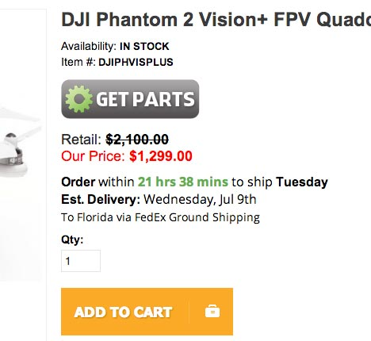

shipping-time
=============

Shipping Time is a jQuery plugin that displays the time until the shipping cut off for your eCommerce website. You can also configure it to show estimated delivery dates based on user location.

This plugin can help increase conversion rates on your store by increasing impulse buys to get an order in for same day shipping.

The output looks like this: 



## Requirements 
Shipping Time makes use of jQuery & Moment.js. Both files are included in the vendor directory. 

Include files on your webpage before the closing body tag
```html
<script src="vendor/jquery-1.9.1.min.js"></script>
<script src="vendor/moment.min.js"></script>
<script src="jquery.shiptime.js"></script>
```

## Installation 
Attach the plugin to the element that you want to output the information
```html <!-- an html element !-->
<div id="shipping-time">
</div>
```

Call the plugin in your javascript file after the dom has finished loading
```javascript 
    jQuery(function($) {
       $('#shipping-time').shipTime();
    });
```

*Take a look at the example included in the example directory if you're having any trouble.* 


Also feel free to use the shipping-time.css file in the example directory for basic styling
```html
<link rel="stylesheet" type="text/css" href="shipping-time.css">
```

## Configuration 
Configuration is included at the top of the jquery.shiptime.js file. It is commented to make it easier to setup. 

You can override any of these settings when your call the plugin like so:
```javascript
$('#shipping-time').shipTime({
    timezone: '-0400',
    deadline: {
        hour: 10,
        minute: 0
    }
});
```

### Time Settings
Set the UTC offset for your location and the time of your shipping cut off in 24 hour format
    var config = {
    
        // UTC timezone offset for your stores location
        timezone: '-0500',
        
        // Enter your shipping cutoff deadline in 24 hour format
        deadline: {
            hour: 16,
            minute: 0
    },


### Shipping Method Name
Set the name of your featured shipping method 
```javascript
// Name of estimated shipping method
shipMethodName: 'Fixed Rate Shipping',
```

### Stock Status
This part targets the element containing your items stock status. Put the selector for jQuery and for inStockText put the text that shows when an item is in stock. ie: In Stock In-stock ect... This will make sure that the plugin only displays for items that are in stock. If you want to just show it for all of your items change the value to true.
```javascript
// This is to make sure we only show transit info if an item is in stock!
stockSelector  : 'p.availability',  // selector for element that notifies stock status
inStockText    : 'in-stock',        // in stock text  
//inStockText : true,              // use this if you want to show for all items
```

### Delivery Lead Times
If you're going to display estimated delivery dates put in the lead times for each state based on your shipping method. (UPS & Fedex generate maps with estimated times based on your location) The plugin detects the users location based on their ip address and delivers an estimated date based on your settings.
```javascript
// If you want to estimate delivery dates enter estimated lead time for each state in days
leadtime: {
    'Alabama': 2,
    'Alaska': 6,
    'Arizona': 5,
```

### Styling
There are some classes in the output to allow you to add some custom styling. 

The output looks like this:

```html
<div id="shipping-time">
<span class="order">Order</span> within <span class="time-left">21 hrs 38 mins</span> to ship <span class="ship-day">Tuesday</span></p>
<span class="est-delivery">Est. Delivery:</span> Wednesday, Jul 9th<br><span class="deliver-time">To Florida via FedEx Ground Shipping</span></p>
</div>
```

## Dependencies 
jQuery - http://jquery.com
Moment.js - http://momentjs.com
